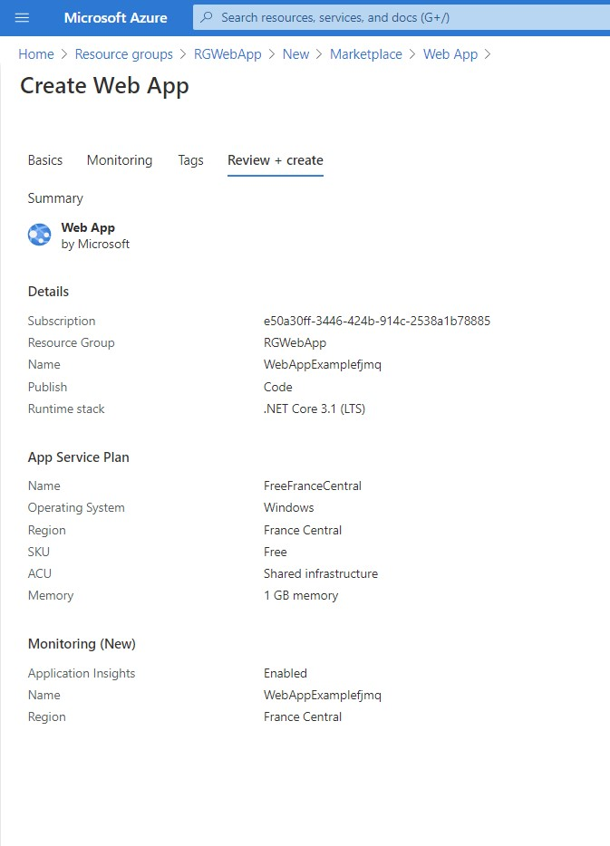
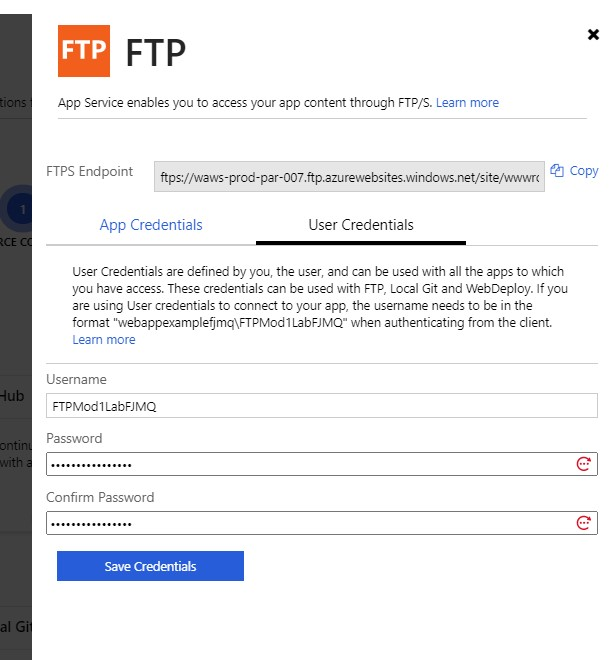

# Module 5: Hosting Services On-Premises and in Azure

# Lesson 2: Hosting Services in Web Apps Feature of Azure App Service

### Demonstration: Hosting ASP.NET Core Web APIs in Web Apps

- Abrimos el portal de azure
- Creamos un nuevo Web App 



- Creamos un proyecto WebApi de ejemplo por consola 
- El modo de despliegue lo seleccionamos por FTP
- Creamos el usuario 



- Cremos en el proyecto un fichero Azure.pubxml que contendra los datos de la publicacion

  
  
  ```xml
<Project>
      <PropertyGroup>
      <PublishProtocol>Kudu</PublishProtocol>
      <PublishSiteName>WebAppExamplefjmq</PublishSiteName>
      <UserName>FTPMod1LabFJMQ</UserName>
      <Password>FTPMod1LabFJMQ1*</Password>
      </PropertyGroup>
  </Project>
  ```

- publicamos

```xml
 dotnet publish /p:PublishProfile=Azure /p:Configuration=Release
```


- Comprobamos

  

